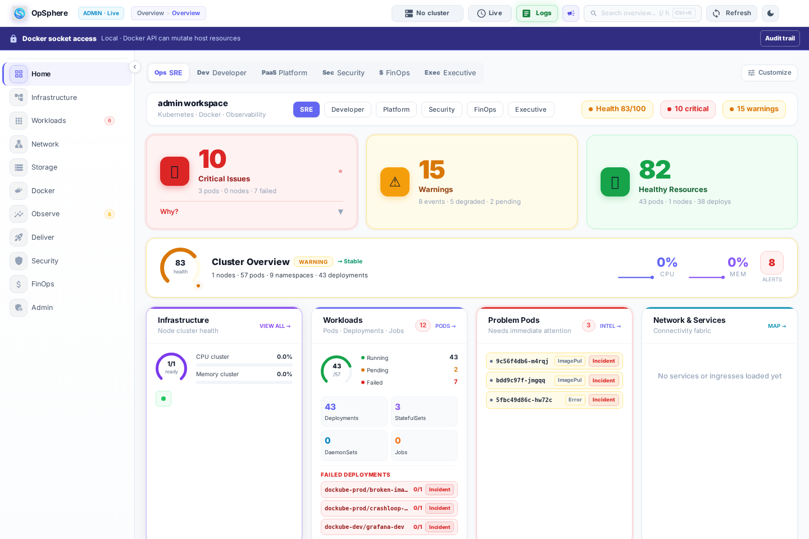
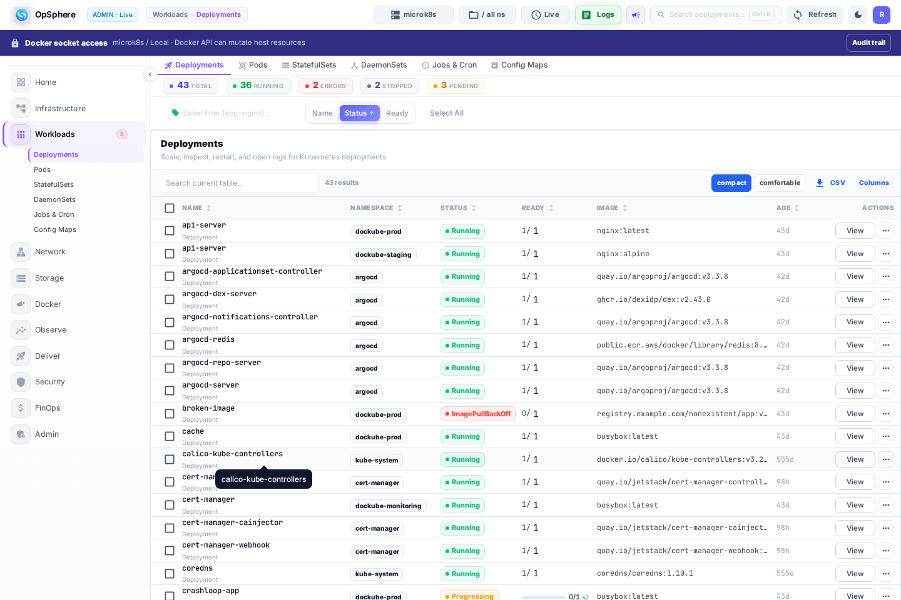
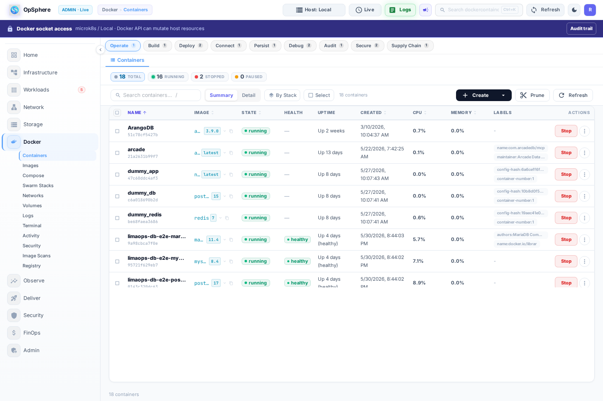
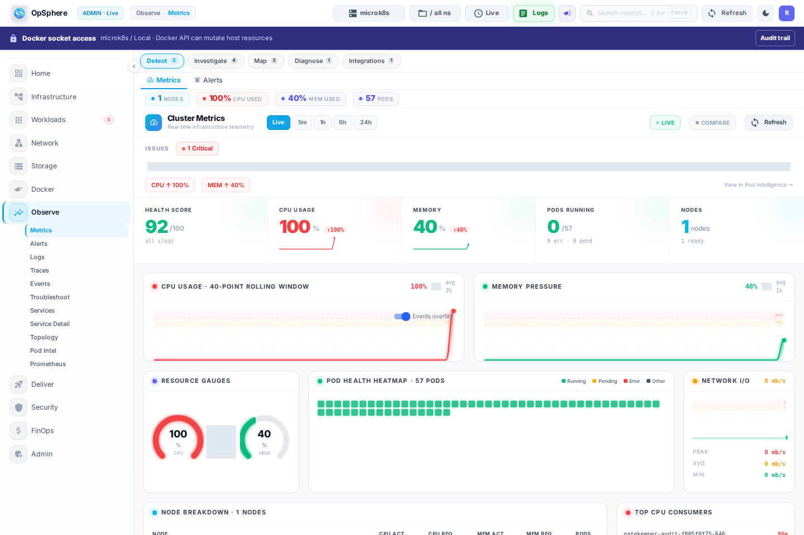
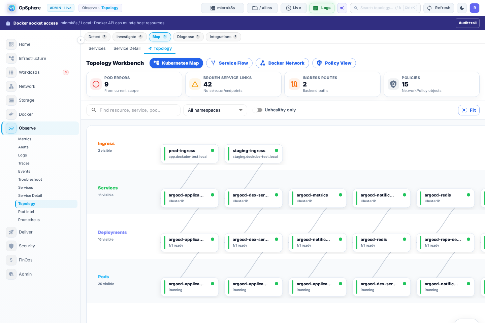
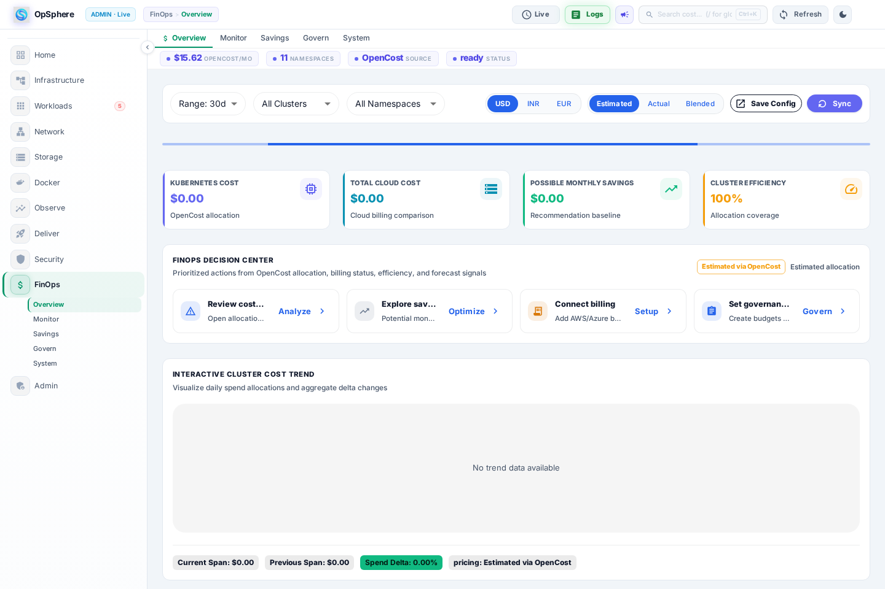

# OpSphere Showcase

This repository is a screenshot-only showcase for OpSphere, a modern operations control plane for Docker, Kubernetes, observability, FinOps, and platform governance.

It is intentionally limited. The full source code, deployment internals, credentials, secrets, and sensitive administration screens are not included here. These images are meant for client demos, portfolio sharing, and high-level product review.

## Preview

### Home Overview

The Home view summarizes cluster health, workload status, live activity, resource usage, and operational navigation in one place.

### Kubernetes Workloads

The Kubernetes workload view focuses on deployment health, replica status, namespace context, and day-to-day workload operations.

### Docker Operations

Docker views provide host-level container visibility, runtime status, and operational controls from the same console.

### Observability Metrics

The metrics workspace gives teams a focused view of cluster utilization, node breakdown, pod health, namespace usage, and high-consumption workloads.

### Topology

The topology view helps visualize relationships between Kubernetes resources and service paths.

### FinOps Overview

FinOps views help summarize cost, savings opportunities, allocation patterns, and infrastructure efficiency.

## What Is Shown

- Product layout and navigation
- Home dashboard experience
- Kubernetes workload management
- Docker container operations
- Observability and topology surfaces
- FinOps overview experience

## What Is Not Included

- Application source code
- Backend APIs or database schema
- Credentials, tokens, secrets, or environment files
- Sensitive admin, user, SSO, secret, or security configuration screens
- Complete infrastructure or production deployment details

## Notes

Screenshots were captured from a local OpSphere environment and sanitized for public/client-facing sharing. The images are representative of the product experience and should not be treated as production data.
